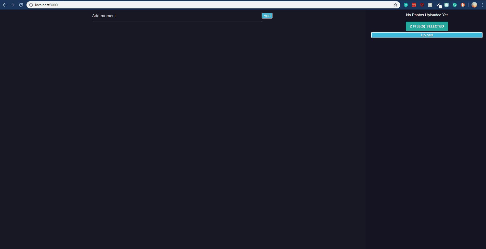

# Timeline App

## Created using React, GraphQL, and MongoDB

## How to USE:

1. Signup for an account using your email
2. Login to the site using your email and password
3. Add as many pictures as you like
4. Drag and drop your pictures to create a timeline of your favourite memories
5. Add a comment about your picture

## Example Site

## Demonstration

### Open Issues:

1. Styling changes needed
2. Add title for timeline page
